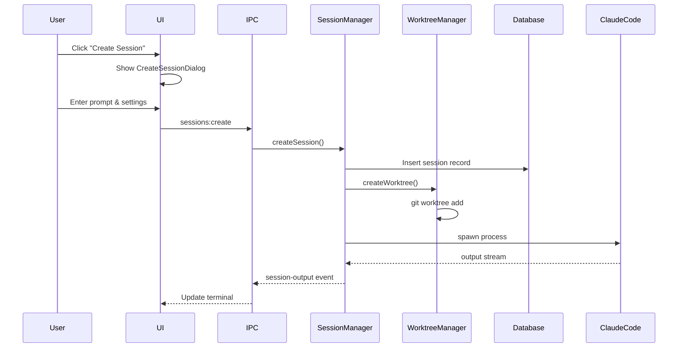
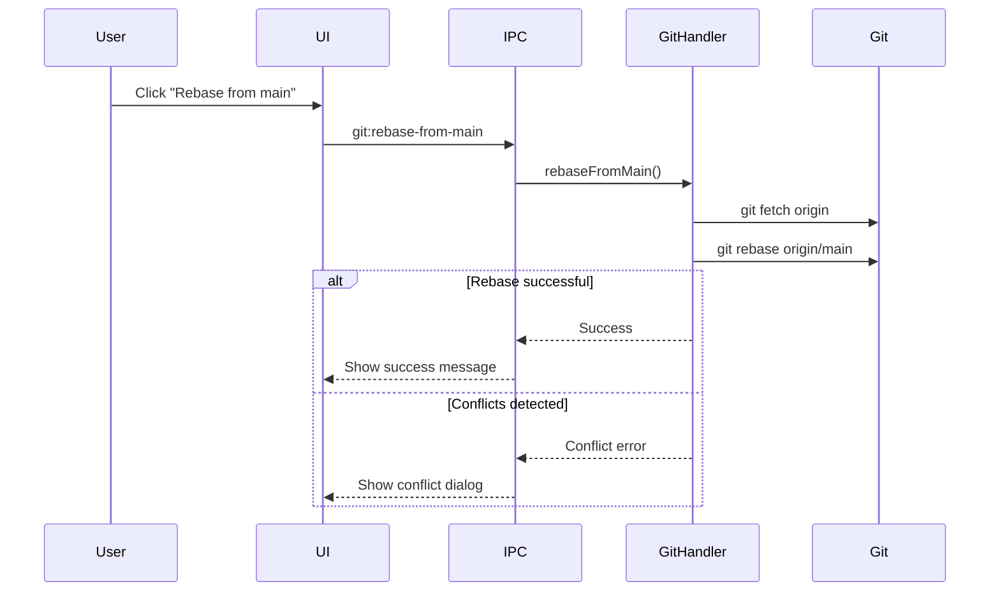

# Crystal - Multi-Session Claude Code Manager

Created by [Stravu](https://stravu.com/?utm_source=Crystal&utm_medium=OS&utm_campaign=Crystal&utm_id=1)

## 🚨 MANDATORY SECTION FOR ALL AI AGENTS 🚨

### Critical Instructions - READ FIRST

**EVERY AI agent working on this project MUST follow these rules WITHOUT EXCEPTION:**

1. **BUILD AND TEST REQUIREMENT**: 
   - ALWAYS build the project after making changes using: `npm run dist`
   - This creates the packaged Linux AppImage in `dist-electron/`
   - Test your changes by running the built application
   - NEVER commit code without building and testing first

2. **NO UNAUTHORIZED FILE CREATION**:
   - NEVER create new files unless explicitly required for the feature
   - ALWAYS prefer editing existing files over creating new ones
   - NEVER create documentation files (*.md) unless specifically requested

3. **STATE MANAGEMENT RULES**:
   - NEVER modify session output handling without explicit permission (see Critical Implementation Details)
   - Use targeted state updates - avoid global refreshes
   - Follow the established IPC event patterns

4. **GIT WORKFLOW**:
   - This project uses git worktrees for parallel development
   - Each Claude session operates in its own worktree
   - NEVER commit directly to main branch
   - Always work in your assigned worktree

5. **DEPENDENCY MANAGEMENT**:
   - Use `yarn` for package management (NOT npm or pnpm for dependencies)
   - Exception: Use `npm run dist` for building only
   - If you encounter memory issues: `NODE_OPTIONS="--max-old-space-size=8192" yarn install`

6. **CODE STYLE**:
   - Follow existing patterns in the codebase
   - Use TypeScript strictly - no `any` types without justification
   - Maintain the modular architecture - don't create monolithic files

7. **TESTING COMMANDS**:
   ```bash
   # Development mode (use for testing changes)
   yarn electron-dev
   
   # Build and package for Linux (use before committing)
   npm run dist
   
   # Type checking (must pass)
   yarn typecheck
   
   # Linting (must pass)
   yarn lint
   ```

### Quick Start for AI Agents

```bash
# 1. Check your current worktree
pwd  # Should be in /home/exworm/projects/crystal/worktrees/[session-name]

# 2. Install dependencies if needed
yarn install

# 3. Run in development mode to test
yarn electron-dev

# 4. Make your changes

# 5. Build and test the packaged app
npm run dist

# 6. Run the built app to verify
./dist-electron/Crystal-*.AppImage

# 7. Only then commit your changes
```

## Project Overview

Crystal is a fully-implemented Electron desktop application for managing multiple Claude Code instances against a single directory using git worktrees. It provides a streamlined interface for running parallel Claude Code sessions with different approaches to the same problem.

## References
Use these reference pages for more information:
- How to invoke Claude Code through the command line as an SDK: https://docs.anthropic.com/en/docs/claude-code/sdk
- How to run multiple Claude Code instances with Git Worktrees: https://docs.anthropic.com/en/docs/claude-code/tutorials#run-parallel-claude-code-sessions-with-git-worktrees

## Project Structure

```
crystal/
├── frontend/                    # React 19 renderer process
│   ├── src/
│   │   ├── components/         # UI Components (75+ components)
│   │   │   ├── session/       # Session-specific components
│   │   │   ├── ui/           # Reusable UI primitives
│   │   │   └── dashboard/    # Dashboard components
│   │   ├── hooks/            # Custom React hooks
│   │   ├── stores/           # Zustand state management
│   │   ├── styles/           # Design tokens and CSS
│   │   │   └── tokens/       # Color, spacing, typography tokens
│   │   ├── types/            # TypeScript type definitions
│   │   └── utils/            # Utility functions
│   ├── package.json          # Frontend dependencies
│   └── vite.config.ts        # Vite bundler configuration
│
├── main/                       # Electron main process
│   ├── src/
│   │   ├── index.ts          # Main entry point (414 lines)
│   │   ├── events.ts         # Event handling (359 lines)
│   │   ├── database/         # SQLite database layer
│   │   │   ├── database.ts   # Database operations
│   │   │   ├── models.ts     # TypeScript models
│   │   │   ├── schema.sql    # Base schema
│   │   │   └── migrations/   # Schema migrations (20+ files)
│   │   ├── ipc/             # IPC handlers (modular)
│   │   │   ├── git.ts       # Git operations (843 lines)
│   │   │   ├── session.ts   # Session management (428 lines)
│   │   │   └── [15+ more handlers]
│   │   ├── services/        # Business logic layer
│   │   │   ├── sessionManager.ts
│   │   │   ├── worktreeManager.ts
│   │   │   ├── gitStatusManager.ts
│   │   │   └── [12+ more services]
│   │   └── utils/           # Utility functions
│   └── package.json         # Main process dependencies
│
├── shared/                    # Shared types between processes
│   └── types.ts             # Common TypeScript interfaces
│
├── dist-electron/            # Build output directory
│   └── Crystal-*.AppImage   # Packaged Linux application
│
├── docs/                     # Documentation
├── scripts/                  # Build and utility scripts
└── package.json             # Root workspace configuration
```

## Implementation Status: ✅ COMPLETE

All core features have been successfully implemented with significant enhancements beyond the original requirements.

## ✅ Implemented Features

### Core Session Management
- **Multi-session support**: Run multiple Claude Code instances simultaneously
- **Session templates**: Create single or multiple sessions with numbered templates
- **Session persistence**: SQLite database for persistent sessions across restarts
- **Session archiving**: Archive sessions instead of permanent deletion
- **Conversation continuation**: Resume conversations with full history context
- **Real-time status tracking**: initializing, running, waiting, stopped, error
- **Automatic session naming**: AI-powered session name generation based on prompts

### Git Worktree Integration  
- **Isolated development**: Each Claude Code session operates in its own git worktree
- **Conflict prevention**: Prevents conflicts between parallel development efforts
- **Automatic cleanup**: Worktree cleanup when sessions are deleted
- **Branch management**: Support for existing branches or creation of new branches
- **Empty repo handling**: Automatic initial commit for repositories with no commits

### Git Operations
- **Rebase from main**: Pull latest changes from main branch into worktree
- **Squash and rebase to main**: Combine all commits and rebase onto main
- **Diff visualization**: View all changes with syntax highlighting
- **Commit tracking**: History with statistics (additions, deletions, files changed)
- **Uncommitted changes**: Detection and display of uncommitted changes
- **Command preview**: Git command tooltips for transparency
- **Error handling**: Detailed error dialogs with full git output

### Project Management
- **Multiple projects**: Support for multiple projects with easy switching
- **Auto-initialization**: Automatic directory creation and git initialization
- **Project settings**: Custom prompts, run scripts, main branch configuration
- **Active project**: Persistent active project selection

### User Interface
- **Professional terminal**: XTerm.js with 50,000 line scrollback buffer
- **Multiple view modes**:
  - Output View: Formatted terminal output with syntax highlighting
  - Messages View: Raw JSON message inspection for debugging
  - View Diff View: Git diff viewer with file statistics
  - Terminal View: Dedicated terminal for running project scripts
- **Sidebar navigation**: Session list, project selector, prompt history
- **Real-time updates**: IPC-based live output streaming
- **Status indicators**: Color-coded badges with animations
- **Unread indicators**: Activity tracking across views

### Prompt Management
- **Prompt history**: Complete history of all prompts across sessions
- **Search functionality**: Search prompts and session names
- **Quick reuse**: One-click prompt reuse for new sessions
- **Prompt navigation**: Jump to specific prompts within session output
- **Clipboard support**: Copy prompts to clipboard

### Advanced Terminal Features
- **Multi-line input**: Auto-resizing textarea with keyboard shortcuts
- **Smart formatting**: Automatic formatting of JSON messages
- **Tool call display**: Clear visual structure for Claude's tool usage
- **Script execution**: Run project scripts with real-time output
- **Process management**: Start/stop script processes

### Settings & Configuration
- **Global settings**:
  - Verbose logging toggle
  - Anthropic API key configuration
  - Global system prompt additions
  - Custom Claude executable path
- **Notification settings**:
  - Desktop notifications toggle
  - Sound notifications with Web Audio API
  - Customizable triggers (status changes, waiting, completion, errors)
- **Project-specific settings**:
  - Custom system prompts per project
  - Run scripts for testing/building
  - Main branch customization

### Data Persistence
- **SQLite Database**:
  - `projects`: Project configurations and paths
  - `sessions`: Core session metadata
  - `session_outputs`: Terminal output history
  - `conversation_messages`: Conversation history for continuations
  - `execution_diffs`: Git diff tracking per execution
  - `prompt_markers`: Navigation markers for prompts
- **Automatic initialization**: `~/.crystal` directory created on first run
- **Migration system**: SQL migrations for schema evolution
- **Electron Store**: Application configuration persistence

### Developer Experience
- **Task Queue**: Bull queue with optional Redis support
- **Process Management**: node-pty for Claude Code instances
- **Error handling**: Comprehensive error reporting and recovery
- **Performance optimizations**: Lazy loading, debounced updates, caching
- **Keyboard shortcuts**: Cmd/Ctrl+Enter for input submission

## Technical Stack

### Technology Stack

#### Frontend (Renderer Process)
- **Framework**: React 19 with TypeScript
- **State Management**: Zustand (reactive, performant)
- **UI Framework**: Tailwind CSS with custom design tokens
- **Terminal**: XTerm.js (50,000 line buffer)
- **Code Editor**: Monaco Editor (VS Code's editor)
- **Build Tool**: Vite (fast HMR, optimized builds)
- **Diff Viewer**: react-diff-viewer-continued

#### Backend (Main Process)
- **Runtime**: Node.js 22+ with TypeScript
- **Database**: Better-SQLite3 (synchronous, embedded)
- **Process Management**: node-pty (PTY processes)
- **Task Queue**: Bull (Redis-optional in-memory queue)
- **Claude Integration**: @anthropic-ai/claude-code SDK
- **IPC**: Electron IPC (secure inter-process communication)
- **Git**: Command-line git with worktree support

#### Desktop Framework
- **Electron**: v36.4.0
- **Auto-Updates**: electron-updater
- **Config Storage**: electron-store
- **Platform Support**: Linux (AppImage, .deb), macOS (universal)

## Architecture

```
┌─────────────────────────────────────────────────────────┐
│              Electron Desktop Application                │
├─────────────────────────────────────────────────────────┤
│             Renderer Process (Frontend)                  │
│  ┌─────────────────┐ ┌─────────────────┐ ┌────────────┐  │
│  │    Sidebar      │ │   Terminal      │ │   Help     │  │
│  │   (Sessions)    │ │   (XTerm.js)    │ │  Dialog    │  │
│  └─────────────────┘ └─────────────────┘ └────────────┘  │
├─────────────────────────────────────────────────────────┤
│                 IPC Communication                        │
├─────────────────────────────────────────────────────────┤
│              Main Process (Electron + Node.js)           │
│ ┌──────────────┐ ┌──────────────┐ ┌───────────────────┐  │
│ │  Task Queue  │ │  Session     │ │   Config         │  │
│ │    (Bull)    │ │  Manager     │ │   Manager        │  │
│ └──────────────┘ └──────────────┘ └───────────────────┘  │
│ ┌──────────────┐ ┌──────────────┐ ┌───────────────────┐  │
│ │  Worktree    │ │ Claude Code  │ │   Config         │  │
│ │  Manager     │ │   Manager    │ │   Manager        │  │
│ └──────────────┘ └──────────────┘ └───────────────────┘  │
│ ┌──────────────┐ ┌──────────────┐ ┌───────────────────┐  │
│ │ IPC Handlers │ │    Event     │ │   Git Diff       │  │
│ │(git,session) │ │   Manager    │ │   Manager        │  │
│ └──────────────┘ └──────────────┘ └───────────────────┘  │
├─────────────────────────────────────────────────────────┤
│            Better-SQLite3 Database                       │
│  ┌─────────────┐ ┌─────────────┐ ┌─────────────────────┐ │
│  │  sessions   │ │session_     │ │conversation_        │ │
│  │   table     │ │outputs      │ │messages             │ │
│  └─────────────┘ └─────────────────┘ └─────────────────────┘ │
│  ┌─────────────┐ ┌─────────────┐ ┌─────────────────────┐ │
│  │execution_   │ │prompt_      │ │ projects            │ │
│  │diffs        │ │markers      │ │                     │ │
│  └─────────────┘ └─────────────┘ └─────────────────────┘ │
├─────────────────────────────────────────────────────────┤
│         Claude Code SDK Instances (node-pty)             │
│              ┌─────────────────────────────┐              │
│              │     Git Worktrees           │              │
│              └─────────────────────────────┘              │
└─────────────────────────────────────────────────────────┘
```

### Component Architecture

```
┌─────────────────────────────────────────────────────────┐
│                    User Interface Layer                   │
├─────────────────────────────────────────────────────────┤
│  Sidebar │ SessionView │ Terminal │ DiffViewer │ Help   │
│  • Sessions List        • XTerm.js                       │
│  • Project Selector     • Output/Messages/Diff tabs      │
│  • Prompt History       • Multi-line input               │
└─────────────────────────────────────────────────────────┘
                              │
                    ┌─────────▼─────────┐
                    │   IPC Bridge       │
                    │ Bi-directional     │
                    │ Event-driven       │
                    └─────────┬─────────┘
                              │
┌─────────────────────────────────────────────────────────┐
│                  Main Process Services                    │
├─────────────────────────────────────────────────────────┤
│ SessionManager │ WorktreeManager │ GitStatusManager      │
│ • Process spawn │ • Worktree ops  │ • Status tracking   │
│ • Output stream │ • Branch mgmt    │ • Diff generation  │
│ • Status track  │ • Cleanup        │ • Commit tracking  │
├─────────────────────────────────────────────────────────┤
│              DatabaseService (SQLite)                     │
│ • Sessions     • Projects      • Outputs                 │
│ • Messages     • Diffs         • Markers                 │
└─────────────────────────────────────────────────────────┘
                              │
                    ┌─────────▼─────────┐
                    │ External Processes │
                    │ • Claude Code      │
                    │ • Git operations   │
                    │ • Terminal PTY     │
                    └───────────────────┘
```

## Database Schema

### Core Tables

```sql
-- Projects: Multi-project support
projects (
  id INTEGER PRIMARY KEY,
  name TEXT NOT NULL,
  path TEXT NOT NULL UNIQUE,
  system_prompt TEXT,
  run_script TEXT,
  build_script TEXT,
  active BOOLEAN DEFAULT 0,
  default_permission_mode TEXT,
  commit_mode TEXT,
  display_order INTEGER
)

-- Sessions: Claude Code instances
sessions (
  id TEXT PRIMARY KEY,
  name TEXT NOT NULL,
  initial_prompt TEXT NOT NULL,
  worktree_name TEXT NOT NULL,
  worktree_path TEXT NOT NULL,
  status TEXT NOT NULL,
  project_id INTEGER,
  folder_id TEXT,
  claude_session_id TEXT,
  permission_mode TEXT,
  is_main_repo BOOLEAN,
  archived BOOLEAN DEFAULT 0,
  is_favorite BOOLEAN DEFAULT 0,
  model TEXT,
  commit_mode TEXT,
  created_at DATETIME,
  updated_at DATETIME,
  last_viewed_at DATETIME,
  run_started_at DATETIME
)

-- Session Outputs: Terminal history
session_outputs (
  id INTEGER PRIMARY KEY,
  session_id TEXT NOT NULL,
  type TEXT NOT NULL, -- stdout/stderr/json/system
  data TEXT NOT NULL,
  timestamp DATETIME,
  FOREIGN KEY (session_id) REFERENCES sessions(id)
)

-- Conversation Messages: Chat history
conversation_messages (
  id INTEGER PRIMARY KEY,
  session_id TEXT NOT NULL,
  message_type TEXT, -- user/assistant
  content TEXT NOT NULL,
  timestamp DATETIME
)

-- Execution Diffs: Git changes per execution
execution_diffs (
  id INTEGER PRIMARY KEY,
  session_id TEXT NOT NULL,
  execution_number INTEGER,
  diff_summary TEXT,
  files_changed TEXT,
  commit_message TEXT,
  timestamp DATETIME
)

-- Prompt Markers: Navigation points
prompt_markers (
  id INTEGER PRIMARY KEY,
  session_id TEXT NOT NULL,
  prompt_text TEXT,
  output_index INTEGER,
  timestamp DATETIME,
  completion_timestamp DATETIME
)
```

## Design System

### Color Tokens (CSS Variables)

```css
/* Brand Colors - Lilac/Purple Theme */
--lilac-500: rgb(139 103 246)  /* Primary brand color */
--lilac-600: rgb(124 79 243)   /* Hover state */
--lilac-700: rgb(104 56 235)   /* Active state */

/* Status Colors */
--green-500: rgb(34 197 94)    /* Success/Running */
--amber-500: rgb(245 158 11)   /* Warning/Waiting */
--red-500: rgb(239 68 68)      /* Error/Failed */
--blue-500: rgb(59 130 246)    /* Info/New activity */

/* Theme Colors */
--background: Light theme uses warm whites
--foreground: Dark grays for text
--surface: Elevated surfaces use subtle shadows
```

### Component Library

#### UI Primitives (`frontend/src/components/ui/`)
- **Button**: Primary, secondary, ghost, outline variants
- **Input/Textarea**: Form controls with validation states
- **Select/Dropdown**: Custom styled selects
- **Switch/Toggle**: Binary state controls
- **Badge/Pill**: Status indicators
- **Card**: Container component with collapsible variant
- **Modal**: Dialog system with backdrop
- **Tooltip**: Contextual help system

#### Session Components (`frontend/src/components/session/`)
- **SessionView**: Main session interface
- **SessionInput**: Multi-line input with image support
- **RichOutputView**: Formatted terminal output
- **MessagesView**: Raw JSON message viewer
- **ViewTabs**: Tab navigation system
- **ThinkingPlaceholder**: Loading states

#### Feature Components
- **DraggableProjectTreeView**: Hierarchical session organization
- **CombinedDiffView**: Git diff visualization
- **PromptHistory**: Searchable prompt archive
- **GitStatusIndicator**: Real-time git status
- **NotificationSettings**: Sound and desktop alerts

## Workflows

### Session Creation Workflow



### Git Operations Workflow



### Build and Deployment Workflow

```bash
# Development Workflow
1. yarn install                    # Install dependencies
2. yarn electron-dev              # Run in development mode
3. Make changes                   # Edit code
4. yarn typecheck                 # Verify types
5. yarn lint                      # Check code style

# Build Workflow
1. yarn build:frontend            # Build React app
2. yarn build:main               # Build main process
3. yarn inject-build-info        # Add version info
4. yarn generate-notices         # Generate licenses
5. electron-builder --linux      # Create AppImage

# Simplified Build (Recommended)
npm run dist                     # Runs all build steps
```

## IPC Communication

### IPC Handlers Structure

```typescript
// Main process handlers in main/src/ipc/
├── session.ts     // Session operations
├── git.ts        // Git operations  
├── project.ts    // Project management
├── config.ts     // Configuration
├── file.ts       // File operations
├── folders.ts    // Folder hierarchy
├── dashboard.ts  // Dashboard data
├── commitMode.ts // Commit features
├── stravu.ts     // Stravu integration
└── [more...]     // 15+ handler modules
```

### Event System

```typescript
// Session Events
'session:created'        // New session created
'session:updated'        // Status/data changed
'session:deleted'        // Session removed
'session:output'         // Terminal output
'session:status-changed' // Status update

// Git Events
'git:status-changed'     // Working tree status
'git:diff-generated'     // Diff available
'git:commit-created'     // Commit successful

// Project Events
'project:activated'      // Active project changed
'project:updated'        // Settings modified
```

## Critical Implementation Details

### Modular Architecture (Refactored)

The main process has been refactored from a monolithic `index.ts` file (previously 2,705 lines) into a modular structure:

- **`index.ts`** (414 lines): Core Electron setup and initialization
- **`ipc/git.ts`** (843 lines): All git-related IPC handlers 
- **`ipc/session.ts`** (428 lines): Session management IPC handlers
- **`events.ts`** (359 lines): Event handling and coordination

The frontend has also been modularized:
- **`useSessionView.ts`** (941 lines): Extracted session view logic from the previous monolithic SessionView component

This modular structure improves maintainability and makes it easier to locate and modify specific functionality.

### Session Output Handling (DO NOT MODIFY WITHOUT EXPLICIT PERMISSION)

⚠️ **WARNING**: The session output handling system is complex and fragile. Modifying it frequently causes issues like duplicate messages, disappearing content, or blank screens. Any changes require explicit user permission.

#### How It Works:

1. **Database Storage**:
   - Raw JSON messages from Claude are stored as-is in the database
   - Stdout/stderr outputs are stored directly
   - No formatting or transformation happens at storage time

2. **Real-time Streaming**:
   - When Claude outputs data, it's saved to the database immediately
   - For JSON messages, a formatted stdout version is sent to the frontend for the Output view
   - The original JSON is also sent for the Messages view
   - This provides immediate visual feedback during active sessions

3. **Session Loading**:
   - When navigating to a session, outputs are loaded from the database
   - The `sessions:get-output` handler transforms JSON messages to formatted stdout on-the-fly
   - Uses `setSessionOutputs` for atomic updates to prevent race conditions

4. **Frontend Display**:
   - The useSessionView hook manages session view logic and state (extracted from SessionView component)
   - A mutex lock (`loadingRef`) prevents concurrent loads
   - Timing is carefully managed with `requestAnimationFrame` and delays
   - The `formattedOutput` state is NOT cleared on session switch - it updates naturally

5. **Key Principles**:
   - Database is the single source of truth
   - Transformations happen on-the-fly, not at storage time
   - Real-time updates supplement but don't replace database data
   - Session switches always reload from database to ensure consistency

#### Common Issues and Solutions:

- **Duplicate messages**: Usually caused by sending both formatted and raw versions
- **Disappearing content**: Often due to clearing output states at the wrong time
- **Black screens**: Typically from race conditions during session switching
- **Content only loads once**: Results from improper state management or missing dependencies

The current implementation carefully balances real-time updates with data persistence to provide a smooth user experience.

### Timestamp Handling Guidelines

⚠️ **IMPORTANT**: Proper timestamp handling is critical for the application to function correctly, especially for prompt duration calculations.

#### Overview

Crystal uses timestamps throughout the application for tracking session activity, prompt execution times, and displaying time-based information. Due to the mix of SQLite database storage and JavaScript Date objects, special care must be taken to ensure timezone consistency.

#### Key Principles

1. **Database Storage**: All timestamps are stored in UTC using SQLite's `CURRENT_TIMESTAMP` or `datetime()` functions
2. **Frontend Display**: Timestamps are parsed as UTC and converted to local time only for display
3. **Consistency**: Always use the timestamp utility functions instead of manual date parsing
4. **Validation**: Always validate timestamps before using them in calculations

#### Timestamp Formats

- **SQLite DATETIME**: `YYYY-MM-DD HH:MM:SS` (stored in UTC without timezone indicator)
- **ISO 8601**: `YYYY-MM-DDTHH:MM:SS.sssZ` (with explicit UTC timezone)
- **JavaScript Date**: Local timezone by default (be careful!)

#### Utility Functions

Crystal provides timestamp utilities in both frontend and backend:

**Backend** (`main/src/utils/timestampUtils.ts`):
```typescript
import { formatForDatabase, getCurrentTimestamp } from '../utils/timestampUtils';

// For database storage
const timestamp = formatForDatabase(); // Returns ISO string
const now = getCurrentTimestamp();    // Alias for formatForDatabase()

// For display formatting
const displayTime = formatForDisplay(timestamp);
```

**Frontend** (`frontend/src/utils/timestampUtils.ts`):
```typescript
import { parseTimestamp, formatDuration, getTimeDifference } from '../utils/timestampUtils';

// Parse SQLite timestamps correctly
const date = parseTimestamp("2024-01-01 12:00:00"); // Handles UTC conversion

// Calculate durations
const durationMs = getTimeDifference(startTime, endTime);
const formatted = formatDuration(durationMs); // "2m 34s"

// Display relative time
const ago = formatDistanceToNow(timestamp); // "5 minutes ago"
```

#### Database Operations

When working with timestamps in SQLite:

```sql
-- Use datetime() for UTC timestamps
INSERT INTO prompt_markers (timestamp) VALUES (datetime('now'));

-- When selecting, append 'Z' for proper UTC parsing
SELECT datetime(timestamp) || 'Z' as timestamp FROM prompt_markers;

-- For completion timestamps with NULL handling
SELECT 
  CASE 
    WHEN completion_timestamp IS NOT NULL 
    THEN datetime(completion_timestamp) || 'Z'
    ELSE NULL
  END as completion_timestamp
FROM prompt_markers;
```

#### Common Patterns

**Creating a new timestamp**:
```typescript
// Backend - for database storage
const timestamp = formatForDatabase();

// Frontend - for immediate use
const now = new Date();
```

**Tracking prompt execution time**:
```typescript
// When prompt starts
db.addPromptMarker(sessionId, promptText, outputIndex);

// When prompt completes
db.updatePromptMarkerCompletion(sessionId);
```

**Calculating duration**:
```typescript
// With completion timestamp
if (prompt.completion_timestamp) {
  const duration = getTimeDifference(prompt.timestamp, prompt.completion_timestamp);
  return formatDuration(duration);
}

// For ongoing prompts
const duration = getTimeDifference(prompt.timestamp); // Uses current time as end
return formatDuration(duration) + ' (ongoing)';
```

#### Common Pitfalls to Avoid

1. **Never parse SQLite timestamps directly with `new Date()`**:
   ```typescript
   // ❌ WRONG - treats UTC as local time
   const date = new Date("2024-01-01 12:00:00");
   
   // ✅ CORRECT - uses parseTimestamp utility
   const date = parseTimestamp("2024-01-01 12:00:00");
   ```

2. **Always validate timestamps before calculations**:
   ```typescript
   if (!isValidTimestamp(timestamp)) {
     return 'Unknown duration';
   }
   ```

3. **Be careful with timezone conversions**:
   ```typescript
   // Database stores UTC, display shows local
   const dbTime = "2024-01-01 12:00:00";    // UTC
   const parsed = parseTimestamp(dbTime);    // Correctly handled as UTC
   const display = formatForDisplay(parsed); // Converts to local for display
   ```

4. **Handle negative durations gracefully**:
   ```typescript
   const duration = endTime - startTime;
   if (duration < 0) {
     console.warn('Negative duration detected');
     return 'Invalid duration';
   }
   ```

#### Testing Timestamp Code

When testing timestamp-related features:

1. Test with different timezones (especially negative UTC offsets)
2. Test with daylight saving time transitions
3. Test with very old and future timestamps
4. Test with invalid/malformed timestamps
5. Verify duration calculations are always positive

### State Management Guidelines

⚠️ **IMPORTANT**: Crystal follows a targeted update pattern for state management to minimize unnecessary re-renders and network requests.

#### Overview

Crystal uses a combination of Zustand stores, IPC events, and targeted updates to manage application state efficiently. The application prioritizes specific, targeted updates over global refreshes to improve performance and user experience.

#### Key Principles

1. **Targeted Updates**: Always update only the specific data that changed
2. **Event-Driven Updates**: Use IPC events to communicate changes between processes
3. **Avoid Global Refreshes**: Never reload entire lists when only one item changes
4. **Database as Source of Truth**: Frontend state should reflect backend state, not override it

#### State Update Patterns

**Session Updates**:
```typescript
// ❌ BAD: Global refresh
const handleSessionCreated = () => {
  loadProjectsWithSessions(); // Reloads everything
};

// ✅ GOOD: Targeted update
const handleSessionCreated = (newSession: Session) => {
  setProjectsWithSessions(prevProjects => {
    return prevProjects.map(project => {
      if (project.id === newSession.projectId) {
        return {
          ...project,
          sessions: [...project.sessions, newSession]
        };
      }
      return project;
    });
  });
};
```

**Project Updates**:
```typescript
// ❌ BAD: Reload all projects
const handleProjectDeleted = () => {
  fetchProjects(); // Network request for all projects
};

// ✅ GOOD: Remove from local state
const handleProjectDeleted = () => {
  setProjects(prev => prev.filter(p => p.id !== deletedId));
};
```

#### IPC Event Handling

The application uses IPC events to synchronize state between the main process and renderer:

1. **Session Events**:
   - `session:created` - Add new session to appropriate project
   - `session:updated` - Update specific session properties
   - `session:deleted` - Remove session from project list

2. **Project Events** (if implemented):
   - `project:created` - Add new project to list
   - `project:updated` - Update specific project properties
   - `project:deleted` - Remove project from list

#### When Global Refreshes Are Acceptable

- **Initial Load**: When component mounts for the first time
- **User-Triggered Refresh**: When user explicitly requests a refresh
- **Error Recovery**: After connection loss or critical errors
- **Complex State Changes**: When multiple interdependent items change

#### Implementation Examples

**DraggableProjectTreeView.tsx**:
- Uses targeted updates for session creation, update, and deletion
- Only reloads all data on initial mount or when critical errors occur
- Maintains local state synchronized with backend through IPC events

**ProjectSelector.tsx**:
- Updates project list locally when projects are deleted
- Falls back to refresh only when necessary (e.g., complex updates)

#### Best Practices

1. **Use State Setters with Callbacks**: Always use the callback form of setState to ensure you're working with the latest state
2. **Merge Updates**: When updating objects, spread existing properties to preserve data
3. **Handle Edge Cases**: Always check if the item exists before updating
4. **Log State Changes**: Add console logs for debugging state updates in development
5. **Validate IPC Data**: Ensure IPC events contain expected data structure

### Diff Viewer CSS Troubleshooting

⚠️ **IMPORTANT**: The diff viewer (react-diff-viewer-continued) has specific CSS requirements that can be tricky to debug.

#### Common Issue: No Scrollbars on Diff Viewer

If the diff viewer content is cut off and scrollbars don't appear:

1. **DO NOT add complex CSS overrides** - This often makes the problem worse
2. **Check parent containers for `overflow-hidden`** - This is usually the root cause
3. **Use simple `overflow: 'auto'`** on the immediate diff container
4. **Remove any forced widths or min-widths** unless absolutely necessary

#### The Solution That Works:

```tsx
// In DiffViewer.tsx - Keep it simple!
<div className="border border-t-0 border-gray-600 rounded-b-lg" style={{ overflow: 'auto', maxHeight: '600px' }}>
  <ReactDiffViewer
    oldValue={file.oldValue || ''}
    newValue={file.newValue || ''}
    splitView={viewType === 'split'}
    useDarkTheme={isDarkMode}
    styles={currentStyles}
    // Don't add complex style overrides here
  />
</div>
```

#### What NOT to Do:

- Don't add multiple wrapper divs with conflicting overflow settings
- Don't use CSS-in-JS to override react-diff-viewer's internal styles
- Don't add global CSS selectors targeting generated class names
- Don't use JavaScript hacks to force reflows

#### Root Cause:

The issue is typically caused by parent containers having `overflow-hidden` which prevents child scrollbars from appearing. Check these files:
- `SessionView.tsx` - Look for `overflow-hidden` classes
- `CombinedDiffView.tsx` - Check both the main container and flex containers
- `App.tsx` - Sometimes the issue starts at the app root level

The react-diff-viewer-continued library uses emotion/styled-components internally, which makes CSS overrides unreliable. The best approach is to ensure proper overflow handling in parent containers and keep the diff viewer wrapper simple.

## API Endpoints

### Session Management
- `GET /api/sessions` - List all sessions with status
- `POST /api/sessions` - Create new session(s) with templates
- `GET /api/sessions/:id` - Get specific session details
- `DELETE /api/sessions/:id` - Archive session and cleanup worktree

### Session Interaction  
- `POST /api/sessions/:id/input` - Send input to Claude Code instance
- `POST /api/sessions/:id/continue` - Continue conversation with full history
- `GET /api/sessions/:id/output` - Retrieve session output history
- `GET /api/sessions/:id/conversation` - Get conversation message history

### Configuration
- `GET /api/config` - Get current application configuration
- `POST /api/config` - Update configuration settings

### Project Management
- `GET /api/projects` - List all projects
- `POST /api/projects` - Create new project (with automatic directory/git init)
- `GET /api/projects/:id` - Get project details
- `PUT /api/projects/:id` - Update project settings
- `POST /api/projects/:id/activate` - Set active project
- `DELETE /api/projects/:id` - Delete project

### Prompt Management
- `GET /api/prompts` - Get all prompts with associated sessions
- `GET /api/prompts/:sessionId/:lineNumber` - Navigate to specific prompt

## Development Workflow

1. **Session Creation**: User provides prompt and worktree template via dialog
2. **Worktree Setup**: Backend creates new git worktree using `git worktree add`
3. **Claude Instance**: Spawns Claude Code process in worktree using node-pty
4. **Database Storage**: Session metadata and output stored in SQLite
5. **Real-time Updates**: IPC streams session status and terminal output
6. **Session Management**: Users can switch between sessions, continue conversations

## Available Commands

### Development Commands

```bash
# Install dependencies (use yarn instead of pnpm)
yarn install

# Run as Electron app in development mode
yarn electron-dev
# Or use the shorthand:
yarn run dev

# Run frontend only (without Electron shell)
yarn dev

# Type checking
yarn typecheck

# Linting
yarn lint
```

### Build Commands

```bash
# Build frontend only
yarn run build:frontend

# Build main process only
yarn run build:main

# Build everything
yarn build

# Build and package for Linux (single command)
npm run dist
# This runs: yarn run build:frontend && yarn run build:main && yarn run inject-build-info && yarn run generate-notices && yarn run electron-builder --linux --publish never
```

### Building Packaged Electron App

```bash
# Build for Linux (creates AppImage and .deb)
yarn run build:linux
# Or use the simplified command:
npm run dist

# Build for macOS (only works on macOS)
yarn build:mac
```

### Important Build Notes

1. **Package Manager**: This project now uses **yarn** instead of pnpm due to memory issues with large dependency trees
2. **Memory Issues**: If you encounter JavaScript heap out of memory errors, use:
   ```bash
   NODE_OPTIONS="--max-old-space-size=8192" yarn install
   ```
3. **Quick Build & Install**: After making changes, run:
   ```bash
   npm run dist
   ```
   This will build and package Crystal, outputting to `dist-electron/Crystal-0.2.2-linux-x86_64.AppImage`
4. **Install to App Launcher**: 
   ```bash
   cp dist-electron/Crystal-*.AppImage ~/.local/bin/Crystal
   chmod +x ~/.local/bin/Crystal
   ```

## Project Structure

```
crystal/
├── frontend/         # React renderer process
│   ├── src/
│   │   ├── components/      # React components
│   │   │   ├── Help.tsx    # Help dialog
│   │   │   └── ...        # Other UI components
│   │   ├── hooks/          # Custom React hooks
│   │   │   └── useSessionView.ts # Session view logic (941 lines)
│   │   ├── stores/         # Zustand state stores
│   │   └── utils/          # Utility functions
├── main/            # Electron main process
│   ├── src/
│   │   ├── index.ts         # Main entry point (reduced to 414 lines)
│   │   ├── preload.ts       # Preload script
│   │   ├── events.ts        # Event handling (359 lines)
│   │   ├── database/        # SQLite database
│   │   ├── ipc/            # IPC handlers (modular)
│   │   │   ├── git.ts      # Git operation handlers (843 lines)
│   │   │   ├── session.ts  # Session operation handlers (428 lines)
│   │   │   └── ...         # Other IPC handlers
│   │   ├── services/        # Business logic services
│   │   │   ├── taskQueue.ts # Bull queue for async tasks
│   │   │   └── ...         # Other service modules
│   │   ├── routes/          # API routes
│   │   └── types/           # TypeScript types
│   └── dist/               # Compiled output
├── shared/          # Shared TypeScript types
├── dist-electron/   # Packaged Electron app
├── package.json     # Root workspace configuration
└── pnpm-workspace.yaml
```

## User Guide

### Quick Start
1. **Create/Select Project**: Choose a project directory or create a new one
2. **Create Session**: Click "Create Session" and enter a prompt
3. **Parallel Sessions**: Run multiple sessions for different approaches
4. **View Results**: Switch between Output, View Diff, and Terminal views

### Using the Help System
- Click the **?** button in the sidebar to open the comprehensive help dialog
- The help dialog covers all features, keyboard shortcuts, and tips

### Session States Explained
- 🟢 **Initializing**: Setting up git worktree
- 🟢 **Running**: Claude is actively processing
- 🟡 **Waiting**: Needs your input
- ⚪ **Completed**: Task finished successfully
- 🔵 **New Activity**: Session has new unviewed results
- 🔴 **Error**: Something went wrong

### Git Operations
- **Rebase from main**: Updates your worktree with latest main branch changes
- **Squash and rebase**: Combines all commits and rebases onto main
- Always preview commands with tooltips before executing

### Best Practices
1. Use descriptive prompts for better AI-generated session names
2. Create multiple sessions to explore different solutions
3. Review View Diff tab before git operations
4. Use Terminal tab to run tests after changes
5. Archive completed sessions to keep the list manageable
6. Set up project-specific prompts for consistency

## Troubleshooting

### Common Issues
1. **Session won't start**: Check if git repository is initialized
2. **Git operations fail**: Ensure no uncommitted changes conflict
3. **Terminal not responding**: Check if Claude Code is installed correctly
4. **Notifications not working**: Grant permission when prompted

### Debug Mode
Enable verbose logging in Settings to see detailed logs for troubleshooting.

### Frontend Console Debugging (Development Only)

In development mode, Crystal automatically captures all frontend console logs and writes them to a file that Claude Code can read for debugging purposes.

**Location**: `crystal-frontend-debug.log` in the project root directory

**What gets logged**:
- All `console.log`, `console.warn`, `console.error`, `console.info`, and `console.debug` calls from the React frontend
- Automatic console messages from Electron's webContents (warnings, errors)
- Timestamp, log level, and source information for each message

**Example log format**:
```
[2024-07-21T15:30:45.123Z] [RENDERER LOG] User clicked session creation button
[2024-07-21T15:30:45.234Z] [FRONTEND WARNING] Session validation failed: missing prompt
[2024-07-21T15:30:45.345Z] [FRONTEND ERROR] Failed to create session (SessionView.tsx:123)
```

**Usage for Claude Code debugging**:
1. Add debug console.log statements to frontend components
2. Reproduce the issue in the Crystal app
3. Read `crystal-frontend-debug.log` to see what happened
4. No need to manually check Chrome DevTools or ask humans to copy logs

**File rotation**: The log file grows continuously during development. Delete or truncate it manually if it gets too large.

**Note**: This feature is only active in development mode and will not affect production builds.

## Development Commands

### Essential Commands

```bash
# Install dependencies
yarn install

# Development mode
yarn electron-dev       # Full Electron app
yarn dev               # Frontend only

# Build and package
npm run dist           # Build for Linux (recommended)
yarn build:mac        # Build for macOS
yarn build:frontend   # Frontend only
yarn build:main      # Main process only

# Code quality
yarn typecheck        # Type checking
yarn lint            # Linting
yarn test           # Run tests

# After building
./dist-electron/Crystal-*.AppImage  # Run built app
```

### Troubleshooting

```bash
# Memory issues during install
NODE_OPTIONS="--max-old-space-size=8192" yarn install

# Rebuild native modules
yarn electron:rebuild

# Clean build
rm -rf frontend/dist main/dist dist-electron
npm run dist
```

## Configuration Files

### Root Configuration
- `package.json` - Workspace configuration
- `pnpm-workspace.yaml` - Monorepo setup
- `.env` - Environment variables (create if needed)

### Frontend Configuration
- `frontend/vite.config.ts` - Vite bundler
- `frontend/tailwind.config.js` - Tailwind CSS
- `frontend/tsconfig.json` - TypeScript

### Main Configuration
- `main/tsconfig.json` - TypeScript
- `main/vitest.config.ts` - Test runner

### Build Configuration
- `electron-builder` config in root package.json
- Platform-specific settings for Linux/macOS

## Testing

```bash
# Unit tests
yarn test              # Run all tests
yarn test:watch       # Watch mode
yarn test:coverage    # Coverage report

# E2E tests (Playwright)
yarn test:ui          # Interactive UI
yarn test:headed      # Browser visible
yarn test:ci         # CI mode
```

## Deployment

### Linux Build
```bash
npm run dist
# Creates:
# - dist-electron/Crystal-{version}-linux-x86_64.AppImage
# - dist-electron/Crystal-{version}-linux-x64.deb
```

### macOS Build
```bash
yarn build:mac           # Intel + Apple Silicon
yarn build:mac:x64      # Intel only
yarn build:mac:arm64    # Apple Silicon only
```

### Release Process
1. Update version in package.json files
2. Build with `npm run dist`
3. Test the built application
4. Create git tag
5. GitHub Actions handles release

## Security Considerations

- Electron context isolation enabled
- Preload scripts for secure IPC
- No remote content loading
- Sanitized user inputs
- Secure storage for API keys
- Git operations sandboxed to worktrees

## Performance Optimizations

- Lazy loading of session outputs
- Debounced state updates
- Virtual scrolling in terminal
- Cached git status
- Optimized diff generation
- Incremental session loading
- Request animation frame for UI updates

## Known Issues and Solutions

### Diff Viewer Scrollbars
- Keep wrapper simple with `overflow: auto`
- Don't override internal styles
- Check parent containers for `overflow-hidden`

### Session Output Issues
- Don't modify without permission
- Database is source of truth
- Transformations are on-demand

### Timestamp Calculations
- Always use utility functions
- Store in UTC, display in local
- Validate before calculations

## Support and Resources

- **Documentation**: `/docs` directory
- **Architecture**: `docs/CRYSTAL_ARCHITECTURE.md`
- **Database**: `docs/DATABASE_DOCUMENTATION.md`
- **Troubleshooting**: `docs/troubleshooting/`
- **GitHub Issues**: Report bugs and features
- **Discord**: Community support

## License

MIT License - See LICENSE file

## Disclaimer

Crystal is an independent project created by [Stravu](https://stravu.com/?utm_source=Crystal&utm_medium=OS&utm_campaign=Crystal&utm_id=1). Claude™ is a trademark of Anthropic, PBC. Crystal is not affiliated with, endorsed by, or sponsored by Anthropic. This tool is designed to work with Claude Code, which must be installed separately.